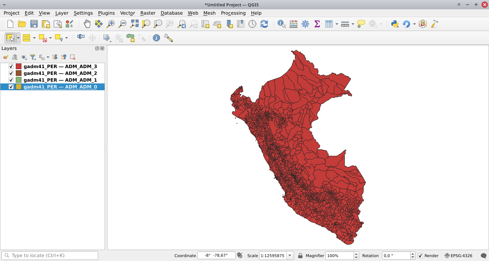

=========================
Subnational jurisdictions
=========================

..
    This case_study.rst file is automatically generated. Please do not
    modify it. If you want to make changes to this file, modify the
    case_study.org source file directly.

.. |br| raw:: html

   

Objective
---------

The aim is to obtain a GPKG file named ``aoi_latlon.gpkg`` with two layers named ``aoi`` for the jurisdiction and ``subj`` for the subjurisdictions.
This file can then be used with the ``deforisk`` plugin to define the area of interest (AOI).

File creation using QGIS tools
------------------------------

Download country data from `GADM <https://gadm.org>`_ using a GPKG file.

.. image:: ../_static/articles/gadm_peru.png
    :width: 650px

|br|

Add all layers from the GPKG file to QGIS.

|br|

Select the jurisdiction, using the selection toolbar (if the toolbar is not visible, activate it in ``View > Toolbars > Selection Toolbar``).

.. image:: ../_static/articles/select_jurisdiction.png
    :width: 650px

|br|

Save the feature in a new GPKG file called ``aoi_latlon.gpkg`` right clicking on the layer and selecting ``Export > Save Selected Feature As``. Tick ``Save only selected features`` and name the layer ``aoi`` (it is mandatory to use this layer name). 

.. image:: ../_static/articles/save_jurisdiction.png
    :width: 500px

|br|

Select the subjurisdictions (to save several features with the selection tool, maintain the ``Ctrl`` button pushed).

.. image:: ../_static/articles/select_subjurisdictions.png
    :width: 650px

|br|

Save the features in the same GPKG file as previously (``aoi_latlon.gpkg``) and name the layer ``subj`` (it is also mandatory to use this layer name).

.. image:: ../_static/articles/save_subjurisdictions.png
    :width: 500px

|br|

We have just created a GPKG file named ``aoi_latlon.gpkg`` with two layers named ``aoi`` for the jurisdiction and ``subj`` for the subjurisdictions.
Note that you can select jurisdiction and subjurisdictions at different administrative levels, selecting features at level 1, 2, or 3 in the GADM dataset.

Looking at the data in QGIS
---------------------------

- Open the file Browser. If not visible, activate it in ``View > Panels > Browser``.

- Search for the ``aoi_latlon.gpkg`` file in your folders.

- Drag and drop the GPKG file to add the ``aoi`` and ``subj`` layers in the list of QGIS layers.

.. image:: ../_static/articles/file_browser.png
    :width: 650px

Use with the deforisk plugin
----------------------------

Select the GPKG file when defining the area of interest (AOI).

.. image:: ../_static/articles/interface_aoi_madre_de_dios.png
    :width: 500px
