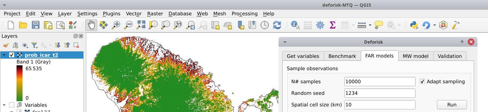

..
    This index.rst file is automatically generated. Please do not
    modify it. If you want to make changes to this file, modify the
    index.org source file directly.

.. image:: ./\_static/logo-deforisk.svg
    :target: https://ecology.ghislainv.fr/deforisk-qgis-plugin
    :align: right
    :width: 140px
    :alt: Logo riskmapjnr

====================
deforisk QGIS plugin
====================

.. image:: https://img.shields.io/badge/licence-GPLv3-8f10cb.svg
    :target: https://www.gnu.org/licenses/gpl-3.0.html
.. image:: https://img.shields.io/badge/GitHub-repo-green.svg
    :target: https://github.com/ghislainv/deforisk-qgis-plugin
.. image:: https://img.shields.io/badge/web-FAR\_QGIS\_plugin-blue.svg
    :target: https://ecology.ghislainv.fr/deforisk-qgis-plugin
.. image:: https://img.shields.io/badge/python-forestatrisk-orange?logo=python&logoColor=ffd43b&.svg
    :target: https://ecology.ghislainv.fr/forestatrisk
.. image:: https://img.shields.io/badge/python-riskmapjnr-yellow?logo=python&logoColor=ffd43b&.svg
    :target: https://ecology.ghislainv.fr/riskmapjnr

Functionalities
---------------

The ``deforisk`` QGis plugin can be used to map the deforestation risk for a country or area of interest. Four models can be used to derive the risk maps: iCAR, GLM, Random Forest, and Moving Window models. All models are calibrated using past deforestation observations for a given period of time between 2000 and 2022. Forest cover change maps are provided by the user or derived from two global tree/forest cover change products: `Global Forest Change <https://earthenginepartners.appspot.com/science-2013-global-forest>`_ and `Tropical Moist Forests <https://forobs.jrc.ec.europa.eu/TMF>`_.

Deforestation risk maps obtained using this plugin can be used to estimate emission reduction impact of forest conservation projects within the `VCS Jurisdictional and Nested REDD+ Framework <https://verra.org/programs/jurisdictional-nested-redd-framework/>`_.

Contributing
------------

The ``deforisk`` QGIS plugin is Open Source and released under the `GNU GPL version 3 license <https://ecology.ghislainv.fr/deforisk-qgis-plugin/license.html>`_. Anybody who is interested can contribute to the package development following our `Community guidelines <https://ecology.ghislainv.fr/deforisk-qgis-plugin/contributing.html>`_. Every contributor must agree to follow the project’s `Code of conduct <https://ecology.ghislainv.fr/deforisk-qgis-plugin/code_of_conduct.html>`_.

.. toctree::
   :hidden:

   Home <self>
   installation
   get_started
   articles
   python_api
   contributing/community_guidelines
   contributing/code_of_conduct
   contributing/license
