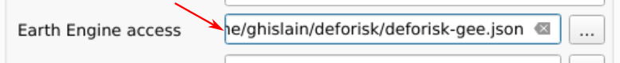
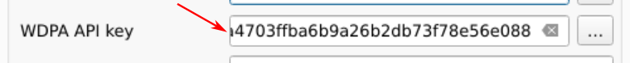

============
Installation
============

..
    This installation.rst file is automatically generated. Please do not
    modify it. If you want to make changes to this file, modify the
    installation.org source file directly.

.. note::

    **Dependencies**: `QGIS <https://www.qgis.org/en/site/>`_ and `GDAL <https://gdal.org/index.html>`_ must be installed on your system before using the ``deforisk`` plugin. *On Unix-like systems*, you must also install `osmconvert <https://wiki.openstreetmap.org/wiki/Osmconvert>`_ and `osmfilter <https://wiki.openstreetmap.org/wiki/Osmfilter>`_. *On Windows systems*, these dependencies are already included in the plugin as binary ``.exe`` files so you don’t need to install them. Then, the ``forestatrisk`` and ``riskmapjnr`` Python packages must be installed on your system. Follow the instructions below to install these dependencies.

.. note::

    **Installation**: We hereby describe two ways for installing the ``deforisk`` plugin:

    - First option is to install the QGIS client and GDAL on your system and then install the ``forestatrisk`` and ``riskmapjnr`` Python packages. This installation procedure is system-dependent.

    - Alternate option is to use conda/miniconda/mamba (one of those three) to install QGIS, GDAL, ``forestatrisk`` and ``riskmapjnr`` in a dedicated environment. This installation procedure is system-independent.

On Windows
----------

Turn on the developer mode
~~~~~~~~~~~~~~~~~~~~~~~~~~

To be able to use the ``deforisk`` QGIS plugin, you need to activate the developer mode on Windows. The developer mode allows creating symbolic links (symlinks) which are used by the plugin and necessary to avoid copying large files on disk. To activate the developer mode, follow `these instructions <https://learn.microsoft.com/en-us/windows/apps/get-started/enable-your-device-for-development>`_. In summary:

- Enter “for developers” into the search box in the taskbar to go to the “For developers” settings page.

- Toggle the Developer Mode setting, at the top of the “For developers” page.

- Read the disclaimer for the setting you choose. Click “Yes” to accept the change.

Install QGIS and GDAL on Windows
~~~~~~~~~~~~~~~~~~~~~~~~~~~~~~~~

To install QGIS and GDAL on Windows, use the `OSGeo4W <https://trac.osgeo.org/osgeo4w/>`_ network installer. OSGeo4W is a binary distribution of a broad set of open source geospatial software for Windows environments (Windows 11 down to 7). Select *Express Install* and install both QGIS and GDAL. Several Gb of space will be needed on disk to install these programs. This will also install *OSGeo4W Shell* to execute command lines.

Install the ``forestatrisk`` and ``riskmapjnr`` Python packages on Windows
~~~~~~~~~~~~~~~~~~~~~~~~~~~~~~~~~~~~~~~~~~~~~~~~~~~~~~~~~~~~~~~~~~~~~~~~~~

To install the ``forestatrisk`` and ``riskmapjnr`` Python packages, open *OSGeo4W Shell*, and use ``pip``.

.. code:: shell

    python3.exe -m pip install --upgrade forestatrisk riskmapjnr

Note: In case of problems, you can check the version of Python used by OSGeo4W using *OSGeo Shell* and that the package wheels for ``forestatrisk`` and ``riskmapjnr`` are available on `PyPI <https://pypi.org/project/forestatrisk/#files>`_ for your Windows and Python versions. Currently, PyPI provides wheels for Python >= 3.9 for Windows, Linux, and macOS 64-bit systems.

.. code:: shell

    python3.exe --version

On Unix-like systems (Linux and macOS)
--------------------------------------

Install QGIS and GDAL on Unix-like systems
~~~~~~~~~~~~~~~~~~~~~~~~~~~~~~~~~~~~~~~~~~

Install QGIS and GDAL on your system, for example using ``apt-get`` for Debian/Ubuntu Linux distributions.

.. code:: shell

    sudo apt-get update
    sudo apt-get install qgis gdal-bin libgdal-dev

For macOS, you can use the installer available on the `QGIS website <https://www.qgis.org/en/site/forusers/download.html>`_ and install GDAL using `brew <https://formulae.brew.sh/formula/gdal>`_.

After installing GDAL, you can test the installation by running ``gdalinfo --version`` in the command prompt or terminal, which should display the installed GDAL version.

Install ``osmconvert`` and ``osmfilter``
~~~~~~~~~~~~~~~~~~~~~~~~~~~~~~~~~~~~~~~~

On Unix-like systems, you must also install osmconvert and osmfilter before using the ``deforisk`` plugin. osmconvert can be used to convert and process OpenStreetMap files while osmfilter is a command line tool used to filter OpenStreetMap data files for specific tags. To install them on your system, follow the instructions on the `osmconvert <https://wiki.openstreetmap.org/wiki/Osmconvert>`_ and `osmfilter <https://wiki.openstreetmap.org/wiki/Osmfilter>`_ webpages.

Install the ``forestatrisk`` and ``riskmapjnr`` Python packages on Unix-like systems
~~~~~~~~~~~~~~~~~~~~~~~~~~~~~~~~~~~~~~~~~~~~~~~~~~~~~~~~~~~~~~~~~~~~~~~~~~~~~~~~~~~~

On recent systems, you cannot use pip to install Python packages system-wide. As a consequence, we need to create a virtual environment and install the ``forestatrisk`` and ``riskmapjnr`` packages in it. Make sure to also install the appropriate GDAL bindings using ``gdal==$(gdal-config --version)``. Once the package and its dependencies have been installed, you can deactivate the virtual environment.

.. code:: shell

    python3 -m venv /path/to/venv
    source  /path/to/venv/bin/activate
    python3 -m pip install --upgrade forestatrisk riskmapjnr gdal==$(gdal-config --version)
    deactivate

Then, in the ``startup.py`` `Python file <https://docs.qgis.org/3.4/en/docs/pyqgis_developer_cookbook/intro.html#running-python-code-when-qgis-starts>`_, add the following two lines, adapting the path to your specific case (check the Python version). These two lines will be executed when QGIS starts and will add the path to the packages installed in the virtual environment to ``sys.path``.

.. code:: python

    import sys
    sys.path.append("/path/to/venv/lib/python3.11/site-packages/")

Using conda/miniconda (all operating systems)
---------------------------------------------

This alternative method has the advantage of installing `QGIS <https://www.qgis.org/en/site/>`_ and `GDAL <https://gdal.org/index.html>`_ as well as the ``forestatrisk`` and ``riskmapjnr`` Python packages all in a isolated and dedicated environment, with a lightweight version of QGIS. However, caveats are that there are no QGIS desktop icons or file association, and this installation does not include GRASS and SAGA for example (although they can easily be installed with conda subsequently).

Install miniconda
~~~~~~~~~~~~~~~~~

``Conda`` (or its minimal version ``miniconda``) is a package and environment manager. To install ``miniconda``, download the installer from the `miniconda website <https://docs.conda.io/en/latest/miniconda.html>`_ and follow the instructions for your system.

Install QGIS and dependencies in a new environment
~~~~~~~~~~~~~~~~~~~~~~~~~~~~~~~~~~~~~~~~~~~~~~~~~~

In a terminal, create a new environment (here named ``deforisk``) and install ``QGIS`` (via conda packages), ``forestatrisk`` and ``riskmapjnr`` in it. Be aware that ``osmconvert`` and ``osmfilter`` still need to be installed separately on Linux and macOS systems (cf. section above).

.. code:: shell

    conda create -c conda-forge -n deforisk qgis  # create environment and install QGIS (and GDAL embedded)
    conda activate deforisk        # activate the newly created environment
    pip install --upgrade forestatrisk riskmapjnr # install additional Python packages

You can now launch ``QGIS`` from the terminal using the ``qgis`` command.

Deactivate and delete the environment
~~~~~~~~~~~~~~~~~~~~~~~~~~~~~~~~~~~~~

I you want to deactivate an delete the environment:

.. code:: shell

    conda deactivate
    conda env remove --name deforisk

Access to GEE and WDPA
----------------------

The plugin download forest data from Google Earth Engine (GEE) using the ``geefcc`` Python package and protected area data from the World Database on Protected Areas (WDPA) using the ``pywdpa`` Python package. You will need an access to GEE and WDPA to be able to use the plugin.

Access to GEE
~~~~~~~~~~~~~

To be able to use GEE, you will need either (i) a Google account and a Google Cloud project that is `registered to use Earth Engine <https://developers.google.com/earth-engine/guides/access#a-role-in-a-cloud-project>`_ or (ii) a service account allowing you to use Google Earth Engine through a registered Google Cloud project (in this case, you don’t need a Google account). Please follow this link if you want to `register a project for using Earth Engine <https://code.earthengine.google.com/register>`_.

In the ``deforisk`` plugin, for the ``Earth Engine access`` argument available in the “Get variables” tab, you must indicate either the name of a Google Cloud project registered to use Earth Engine (and for which you are identified as a user) or a path to a JSON private key file authorizing you to access Earth Engine through a service account.

Access to WDPA
~~~~~~~~~~~~~~

To uses the Protected Planet API to access data on world protected areas, you must first have obtained a Personal API Token by filling in the `form <https://api.protectedplanet.net/request>`_ available at Protected Planet.

In the ``deforisk`` plugin, for the ``WDPA access`` argument available in the “Get variables” tab, you must indicate either your Personal API Token (a series of letters and numbers such as ``ca4703ffba6b9a26b2db73f78e56e088`` which is a fake token) or a path to a text file specifying the value of the “WDPA\_KEY” environmental variable (eg. a simple text file including on one line ``WDPA_KEY="ca4703ffba6b9a26b2db73f78e56e088"`` for example).

Installing the ``deforisk`` plugin in QGIS
------------------------------------------

- Download the ``deforisk`` `zip file <https://github.com/ghislainv/deforisk-qgis-plugin/archive/refs/heads/main.zip>`_ from GitHub.

- Open QGIS.

- In QGIS menu bar, go to ``Extensions/Install extensions/Install from ZIP``.

- Select the zip file that has been downloaded.
